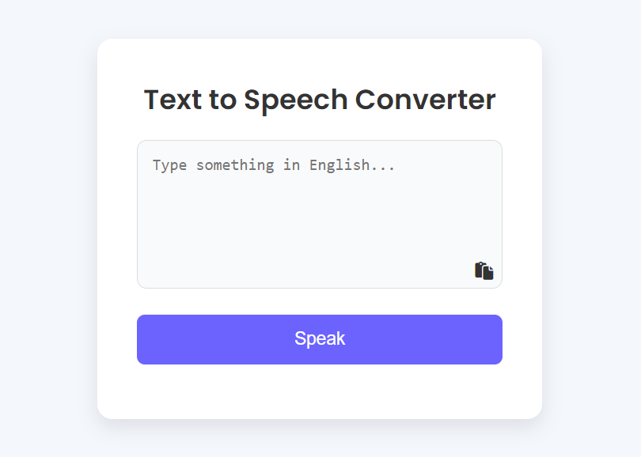

# Text to Speech Converter

This project is a simple **Text to Speech Converter** application built with **JavaScript**, **HTML**, and **CSS**. It allows users to input text in English and convert it to speech. Additionally, users can paste text directly from the clipboard, and the app ensures that the text is in English before conversion.

## Table of Contents
- [ScreenShot](#screenshot)
- [Features](#features)
- [Built With](#built-with)
- [Prerequisites](#prerequisites)
- [Usage](#usage)
- [Contact](#contact)

## ScreenShot



<p align="right">(<a href="#table-of-contents">back to top</a>)</p>

## Features

- **Text to Speech**: Converts input text to speech using the browser's SpeechSynthesis API.
- **Clipboard Paste Support**: Allows users to paste text from the clipboard directly into the text area.
- **Validation**: Ensures the text is in English before converting it to speech.
- **Responsive Design**: Works seamlessly across different screen sizes and devices.
- **User Feedback**: Provides feedback messages for errors or successful operations (e.g., text pasted, speaking, etc.).

<p align="right">(<a href="#table-of-contents">back to top</a>)</p>

## Built With

This project was built using the following technologies:

* 
* 
* 

<p align="right">(<a href="#table-of-contents">back to top</a>)</p>

## Prerequisites

To run this project, all you need is a modern web browser that supports HTML, CSS, and JavaScript. There are **no additional libraries or dependencies** required, as the project is built with **pure JavaScript**.

<p align="right">(<a href="#table-of-contents">back to top</a>)</p>

## Usage

1. Clone the repository or download the project files:
   ```bash
   git clone https://github.com/AmirrezaAhmadi/TextToSpeech-Converter.git

2. Open the TextToSpeech.html file in your browser.

<p align="right">(<a href="#table-of-contents">back to top</a>)</p>

## Contact

You can reach me through the following:

* Email: AmirrezaAhmadi.GH@Gmail.com
* Telegram: https://t.me/AmirrezaDevelop
* Instagram: https://www.instagram.com/codewithamirreza
* Project Link: https://github.com/AmirrezaAhmadi/TextToSpeech-Converter.git

<p align="right">(<a href="#table-of-contents">back to top</a>)</p>